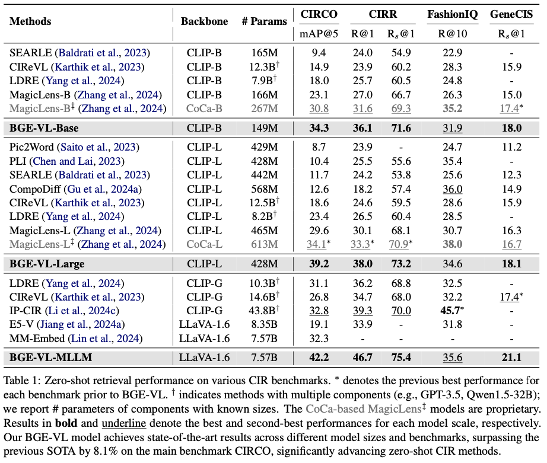
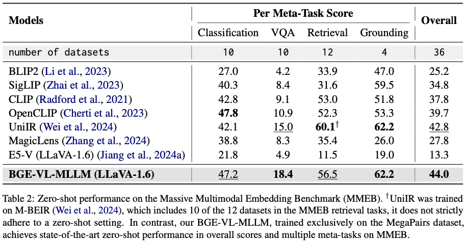
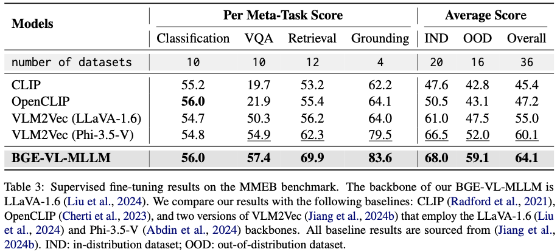
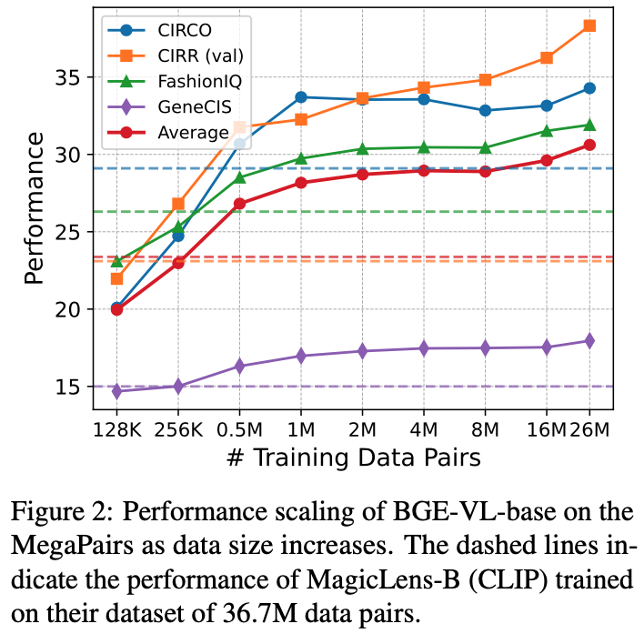

<h1 align="center">MegaPairs: Massive Data Synthesis For Universal Multimodal Retrieval</h1>

<p align="center">
    <a href="https://arxiv.org/abs/2412.14475">
        
    </a>
    <a href="https://github.com/VectorSpaceLab/MegaPairs">
        
    </a>
    <a href="https://huggingface.co/datasets/JUNJIE99/MegaPairs">
        
</p>

<p align="center">
</a>
    <a href="https://huggingface.co/JUNJIE99/MMRet-base">
        
    </a>
    <a href="https://huggingface.co/JUNJIE99/MMRet-large">
        
    </a>
    <a href="https://huggingface.co/JUNJIE99/MMRet-MLLM-S1">
        
    </a>
    <a href="https://huggingface.co/JUNJIE99/MMRet-MLLM-S2">
        
    </a>
</p>

## News
```2024-3-4``` 🚀🚀 We have released the MMRet-MLLM models on Huggingface: [MMRet-MLLM-S1](https://huggingface.co/JUNJIE99/MMRet-MLLM-S1) and [MMRet-MLLM-S2](https://huggingface.co/JUNJIE99/MMRet-MLLM-S2). **MMRet-MLLM-S1** is trained exclusively on our MegaPairs dataset, achieving outstanding performance in composed image retrieval, with an 8.1% improvement on the CIRCO benchmark (mAP@5) over the previous state-of-the-art. **MMRet-MLLM-S2** builds on MMRet-MLLM-S1 with an additional epoch of fine-tuning on the MMEB benchmark training set, delivering enhanced performance across a broader range of multimodal embedding tasks.

```2024-12-27``` 🚀🚀 MMRet-CLIP models are released on Huggingface: [MMRet-base](https://huggingface.co/JUNJIE99/MMRet-base) and [MMRet-large](https://huggingface.co/JUNJIE99/MMRet-large).

```2024-12-19``` 🎉🎉 Release our paper: [MegaPairs: Massive Data Synthesis For Universal Multimodal Retrieval](https://arxiv.org/pdf/2412.14475).

## Release Plan
- [x] Paper
- [x] MMRet-base and MMRet-large models
- [x] MMRet-MLLM model
- [ ] MegaPairs Dataset
- [ ] Evaluation code
- [ ] Fine-tuning code


## Introduction
In this work, we introduce **MegaPairs**, a novel data synthesis method that leverages open-domain images to create *heterogeneous KNN triplets* for universal multimodal retrieval. Our MegaPairs dataset contains over 26 million triplets, and we have trained a series of multimodal retrieval models, **MMRets**, including MMRet-CLIP (base and large) and MMRet-MLLM.

MMRets achieve state-of-the-art performance on four popular zero-shot composed image retrieval benchmarks and the massive multimodal embedding benchmark (MMEB). Extensive experiments demonstrate the ***efficiency, scalability, and generalization*** features of MegaPairs. Please refer to our [paper](https://arxiv.org/abs/2412.14475) for more details.

## Model Usage

### 1. MMRet-CLIP Models
You can easily use MMRet-CLIP models based on ```transformers```
```python
import torch
from transformers import AutoModel

MODEL_NAME = "JUNJIE99/MMRet-base" # or "JUNJIE99/MMRet-large"

model = AutoModel.from_pretrained(MODEL_NAME, trust_remote_code=True) # You must set trust_remote_code=True
model.set_processor(MODEL_NAME)
model.eval()

with torch.no_grad():
    query = model.encode(
        images = "./assets/cir_query.png", 
        text = "Make the background dark, as if the camera has taken the photo at night"
    )

    candidates = model.encode(
        images = ["./assets/cir_candi_1.png", "./assets/cir_candi_2.png"]
    )
    
    scores = query @ candidates.T
print(scores)
```

See the [demo](./retrieval_demo.ipynb) for a complete example of using MMRet for multimodel retrieval.


### 2. MMRet-MLLM Models


```python
import torch
from transformers import AutoModel
from PIL import Image

MODEL_NAME= "JUNJIE99/MMRet-MLLM-S1"

model = AutoModel.from_pretrained(MODEL_NAME, trust_remote_code=True)
model.eval()
model.cuda()

with torch.no_grad():
    model.set_processor(MODEL_NAME)

    query_inputs = model.data_process(
        text="Make the background dark, as if the camera has taken the photo at night", 
        images="./assets/cir_query.png",
        q_or_c="q",
        task_instruction="Retrieve the target image that best meets the combined criteria by using both the provided image and the image retrieval instructions: "
    )

    candidate_inputs = model.data_process(
        images=["./assets/cir_candi_1.png", "./assets/cir_candi_2.png"],
        q_or_c="c",
    )

    query_embs = model(**query_inputs, output_hidden_states=True)[:, -1, :]
    candi_embs = model(**candidate_inputs, output_hidden_states=True)[:, -1, :]
    
    query_embs = torch.nn.functional.normalize(query_embs, dim=-1)
    candi_embs = torch.nn.functional.normalize(candi_embs, dim=-1)

    scores = torch.matmul(query_embs, candi_embs.T)
print(scores)
```


## Model Performance
### Zero-Shot Composed Image Retrieval

MMRet sets a new performance benchmark in zero-shot composed image retrieval tasks. On the CIRCO benchmark, our MMRet-base model, with only 149 million parameters, surpasses all previous models, including those with 50 times more parameters. Additionally, MMRet-MLLM achieves an 8.1% improvement over the previous state-of-the-art model.



### Zero-Shot Performance on MMEB

MMRet-MLLM achieves state-of-the-art zero-shot performance on the Massive Multimodal Embedding Benchmark (MMEB), despite being trained only on the ImageText-to-Image paradigm. This demonstrates the excellent generalization capability of MegaPairs for multimodal embedding.



### Fine-Tuning Performance on MMEB

After fine-tuning on downstream tasks, MMRet-MLLM maintains its leading performance. Notably, it surpasses the previous state-of-the-art by 7.1% on the MMEB out-of-distribution (OOD) set. These results demonstrate the robust generalization capability of MMRet-MLLM and highlight the potential of MegaPairs as foundational training data for universal multimodal embedding.



### Performance Scaling
MegaPairs showcases **scalability**: MMRet-base improves as training data increases. It also demonstrates **efficiency**: with just 0.5M training samples, MMRet-base significantly outperforms MagicLens, which uses the same CLIP-base backbone and was trained on 36.7M samples.




## License
The annotations for MegaPairs and the MMRet models are released under the [MIT License](LICENSE). The images in MegaPairs originate from the [Recap-Datacomp](https://huggingface.co/datasets/UCSC-VLAA/Recap-DataComp-1B), which is released under the CC BY 4.0 license.


## Citation
If you find this repository useful, please consider giving a star ⭐ and citation

```
@article{zhou2024megapairs,
  title={MegaPairs: Massive Data Synthesis For Universal Multimodal Retrieval},
  author={Zhou, Junjie and Liu, Zheng and Liu, Ze and Xiao, Shitao and Wang, Yueze and Zhao, Bo and Zhang, Chen Jason and Lian, Defu and Xiong, Yongping},
  journal={arXiv preprint arXiv:2412.14475},
  year={2024}
}
```
